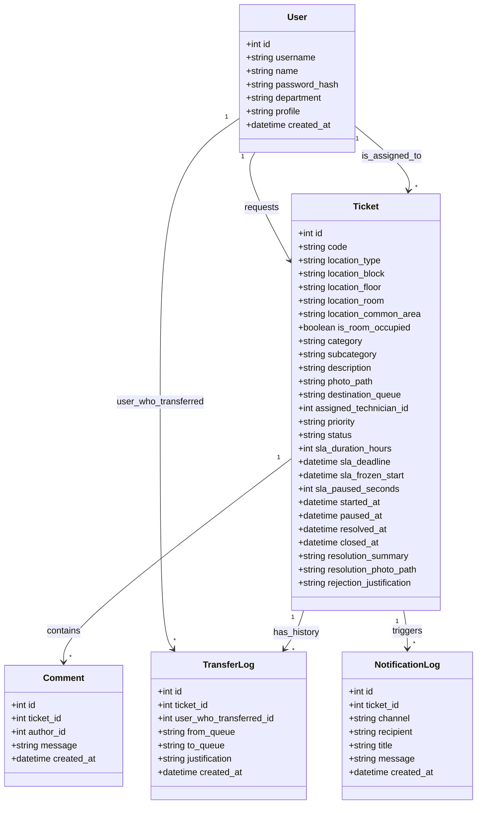
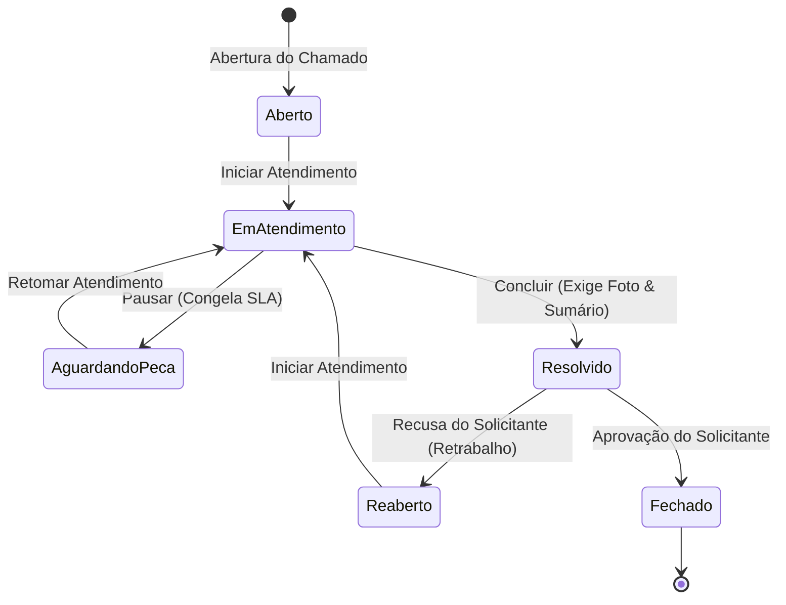

# Especificação Arquitetural e Funcional: Sistema de Chamados Operacionais Hoteleiros (TI & Manutenção)

---

## Resumo Executivo
Este documento apresenta a especificação técnica e funcional detalhada para a construção do **Módulo de Chamados Operacionais** integrado ao ecossistema de gestão de ativos e serviços de hospitalidade. O sistema é projetado sob a filosofia *mobile-first*, permitindo que equipes móveis (governança, recepção, camareiras e técnicos) gerenciem falhas físicas e lógicas com máxima agilidade. O motor de negócios é orientado a **Acordos de Nível de Serviço (SLA)** inteligentes, triagem automática e redundância na comunicação através de canais omnichannel.

---

## 1. Introdução e Contextualização Operacional
No setor de hospitalidade, o tempo de inatividade de uma unidade habitacional (UH) ou de um recurso de infraestrutura crítica reflete diretamente na experiência do cliente e, consequentemente, no faturamento. Um ar-condicionado inoperante em um quarto ocupado exige ação emergencial (tempo de resposta inferior a 2 horas), enquanto o mesmo problema em uma sala de reuniões vazia ou setor administrativo pode ser tratado em regime de manutenção preventiva/corretiva padrão.

O sistema proposto resolve a subjetividade da ponta automatizando a classificação de criticidade a partir do cruzamento de duas variáveis dinâmicas:
1. **Natureza do Problema (Subcategoria)**: Causa raiz do chamado.
2. **Estado de Ocupação da Localização**: Presença de hóspede afetado no local.

---

## 2. Tecnologias e Arquitetura do Sistema

### 2.1 Ecossistema de Tecnologia (Tech Stack)
Para garantir alta performance, baixa latência e facilidade de manutenção, o ecossistema é definido da seguinte forma:
* **Back-end**: Python 3.11+ utilizando o framework **FastAPI**. O FastAPI expõe uma API RESTful limpa e documentada automaticamente via OpenAPI (Swagger).
* **Persistência de Dados (ORM)**: **SQLAlchemy** ou **SQLModel** para mapeamento objeto-relacional.
* **Banco de Dados**: **SQLite** para desenvolvimento local rápido e simplificado; **PostgreSQL** para ambiente de homologação e produção, suportando concorrência de acessos.
* **Mensageria e Filas de Segundo Plano (Async Workers)**: **Redis** como Message Broker e **Celery** (ou **Arq**) para processamento assíncrono.
* **Frontend**: Frameworks modernos como **Vue.js** ou **React** integrados com **Tailwind CSS**. A interface é projetada sob a filosofia *mobile-first* com design pixel-perfect baseado em protótipos do Figma.
  > [!TIP]
  > **Minimização de Latência**: O processamento de notificações de WhatsApp e e-mails é delegado a filas de segundo plano gerenciadas pelo Redis/Celery. Isso evita o travamento das chamadas HTTP no dispositivo móvel do usuário (latência de 3-5 segundos) e permite respostas em milissegundos.

### 2.2 Arquitetura Baseada em APIs e Fluxo Figma ➔ Código
O sistema adota um modelo totalmente desacoplado (Decoupled/Separated Architecture):
* **API REST**: O back-end em Python atua exclusivamente como provedor de dados e executor de regras de negócio, trafegando dados serializados em JSON.
* **Frontend Cliente (SPA)**: A interface é uma aplicação independente (Single Page Application - React ou Vue.js com Tailwind CSS). Ela é compilada de forma extremamente leve, rodando diretamente no navegador móvel do dispositivo do colaborador hoteleiro e realizando trocas de telas instantâneas.
* **O Fluxo Figma ➔ Código (Lei Visual)**:
  * **O Esqueleto (Wireframes)**: A equipe projeta no Figma a interface móvel exata de todas as telas (Tela de Login, Formulário de Abertura em cascata e Quadro de Cartões dos Técnicos).
  * **Contrato Visual**: O protótipo do Figma dita as especificações estéticas do projeto: espaçamentos, tipografia, estados de botões e comportamentos visuais (ex: indicador em vermelho pulsante para quartos com hóspede).
  * **Consumo Assistido (IA)**: Durante a escrita do código do front-end, o desenvolvedor extrai as classes e propriedades CSS/Tailwind do Figma ou fornece imagens estruturais do layout para a Inteligência Artificial. A IA utiliza esses insumos como molde para gerar componentes idênticos aos desenhados pelo time, garantindo simetria de marca e consistência visual.
* **Vantagens**:
  * **Velocidade e Experiência do Usuário (UX)**: A aplicação é carregada uma única vez no celular do funcionário. As trocas de tela ocorrem instantaneamente, pois trafegam somente strings JSON pela rede Wi-Fi do hotel.
  * **Escalabilidade**: A mesma API pode alimentar futuros aplicativos nativos (Android/iOS) ou tótens sem exigir reescrita do core do sistema.

### 2.3 Estrutura de Pastas Profissional (FastAPI)
Para manter o projeto organizado seguindo o princípio de *Separação de Conceitos* (Separation of Concerns), a estrutura do repositório de back-end segue o padrão profissional abaixo:

```plaintext
sistema-hotel-backend/
│
├── app/                      # Pasta raiz de todo o código Python
│   ├── core/                 # Configurações globais e segurança
│   │   ├── config.py         # Leitura de variáveis do arquivo .env (senhas, chaves)
│   │   ├── database.py       # Conexão e inicialização do PostgreSQL/SQLAlchemy
│   │   └── security.py       # Criptografia de senhas e geração do Token JWT de login
│   │
│   ├── models/               # ENTIDADES: Mapeamento direto das tabelas do banco
│   │   ├── usuario.py        # Tabela de Funcionários e permissões (RBAC)
│   │   ├── chamado.py        # Tabela central de chamados e campos de SLA
│   │   └── logs.py           # Tabela de histórico de transbordo e auditoria
│   │
│   ├── schemas/              # VALIDAÇÃO: Formato dos dados que entram e saem da API
│   │   ├── usuario.py        # Valida se o e-mail/matrícula está no formato certo ao criar conta
│   │   └── chamado.py        # Define os campos obrigatórios na abertura do chamado (Pydantic)
│   │
│   ├── api/                  # ROTAS (ENDPOINTS): Portas de entrada do sistema
│   │   ├── auth.py           # Rota de /login (recebe credenciais e devolve o acesso)
│   │   ├── chamados.py       # Rotas /chamados (criar, listar, alterar status, transferir)
│   │   └── usuarios.py       # Rotas de gerenciamento de funcionários
│   │
│   ├── services/             # REGRAS DE NEGÓCIO: Onde a lógica de domínio reside
│   │   ├── sla_service.py    # Lógica em Python que calcula ou congela o SLA do chamado
│   │   └── notify_service.py # Lógica que decide se dispara WhatsApp, E-mail ou Push
│   │
│   └── worker/               # SEGUNDO PLANO: Configuração de tarefas assíncronas
│       └── tasks.py          # Integração com Celery/Redis para enviar as mensagens em background
│
├── migrations/               # Gerado automaticamente pelo Alembic (histórico de migrações)
├── docker-compose.yml        # Configuração do Docker (API, PostgreSQL e Redis juntos)
├── Dockerfile                # Instruções para construir o container da aplicação Python
├── requirements.txt          # Lista de dependências Python (fastapi, sqlalchemy, celery...)
└── .env                      # Credenciais da Locaweb, chaves de APIs e segredos do banco
```

### 2.4 Fluxo de Dados de um Chamado
Para ilustrar como os componentes e diretórios interagem sob este design desacoplado, o ciclo de processamento de um chamado recém-aberto pela recepção segue o fluxo abaixo:

1. **Entrada da Rota**: A requisição HTTP (JSON contendo localização e subcategoria) atinge o endpoint em `app/api/chamados.py`.
2. **Validação**: O FastAPI intercepta a entrada de dados e a valida usando a estrutura definida no schema correspondente em `app/schemas/chamado.py` (ex: checar se os campos de localização não estão vazios). Se houver erro, a API recusa a requisição imediatamente retornando erro HTTP 422.
3. **Regras de Negócio**: O controller chama o `app/services/sla_service.py` que executa as condicionais de SLA baseadas na ocupação do quarto, calculando e inserindo o `sla_deadline`.
4. **Persistência ORM**: Os dados consolidados são mapeados para a entidade em `app/models/chamado.py` e salvos no PostgreSQL pela sessão mantida em `app/core/database.py`.
5. **Mensageria (Background)**: A rota envia uma tarefa de notificação para a fila do Redis via worker de background configurado in `app/worker/tasks.py`. A API do FastAPI responde `"Chamado Criado"` de forma instantânea em milissegundos para o celular do colaborador, enquanto o worker Celery envia silenciosamente o alerta do WhatsApp para o supervisor em background.

---

## 3. Modelo de Domínio (Dados)

### 3.1 Modelo Conceitual do Banco de Dados
Abaixo é detalhado o modelo de entidades e relacionamentos necessário para satisfazer todas as premissas de auditoria, SLA e histórico de reaberturas.

> [!NOTE]
> **Diretrizes de Nullability (SQLAlchemy/ORM)**:
> Devido ao ciclo de vida transicional do chamado, diversos atributos devem ser mapeados como anuláveis (`nullable=True` ou `Optional` em Python):
> - `assigned_technician_id`: Nulo até que haja delegação por parte do supervisor.
> - `started_at`, `resolved_at`, `closed_at`: Gravados apenas nos respectivos gatilhos de status (Em Atendimento, Resolvido, Fechado).
> - `photo_path` e `resolution_photo_path`: Nulos se o colaborador ou técnico optar por não anexar evidências visuais.



---

## 4. Especificação de Módulos

### 4.1 Módulo 1: Autenticação & Entrada de Dados (Abertura)
O sistema exige identificação prévia para fins de responsabilidade civil e trabalhista, além da consolidação de KPIs de produtividade por colaborador.

* **Identificação Única**: Login via matrícula corporativa ou e-mail.
* **Vínculo Departamental**: O usuário herda o departamento (Governança, F&B, Recepção, etc.) que servirá de metadado analítico.
* **Controle de Acesso Baseado em Papéis (RBAC)**:
  * **Colaborador**: Apenas abre chamados e acompanha/homologa os seus próprios chamados.
  * **Supervisor de TI**: Gerencia a fila de Tecnologia e delega tarefas de TI.
  * **Supervisor de Manutenção**: Gerencia a fila de Infraestrutura e distribui Ordens de Serviço (OS).
  * **Técnico Operacional**: Interface ultra-simplificada para visualizar tarefas delegadas e atuar no ciclo de vida.
  * **Gerente Geral**: Visão consolidada (auditoria, relatórios diários de eficiência, cruzamento de dados).

#### 4.1.1 Fluxo Dinâmico de Abertura (Cascade UI)
Para mitigar erros de entrada do usuário operacional em campo:
1. **Tipo de Localização**: "Quarto" ou "Área Comum".
2. Se **Quarto**: Exibe dropdown de *Bloco* -> Filtra *Andar* -> Exibe *Quarto* específico.
   * Ativa a flag **Quarto com Hóspede** (Sim/Não).
3. Se **Área Comum**: Exibe dropdown plano (Lobby, Piscina, Cozinha, etc.).
4. **Dropdown de Categorias**:
   * *Infraestrutura* -> Exibe apenas subcategorias físicas.
   * *Tecnologia* -> Exibe apenas subcategorias digitais/redes.
5. **Mídia**: Upload obrigatório ou opcional de imagem capturada pela câmera do dispositivo.

---

### 4.2 Módulo 2: Triagem Inteligente & Matriz de Prioridades (SLA)

#### 4.2.1 Roteamento Automático de Filas
O sistema utiliza uma tabela estática de roteamento para eliminar a necessidade de triagem manual inicial.

```
Subcategoria ───> Classificação (Infraestrutura ou Tecnologia) ───> Fila de Destino (Manutenção ou TI)
```

#### 4.2.2 Matriz de Prioridade Dinâmica e Cálculo de SLA
O tempo de resolução (SLA) é computado em tempo de execução no backend através da seguinte matriz lógica:

$$\text{Prioridade} = f(\text{Localização}, \text{Estado de Ocupação}, \text{Impacto no Conforto})$$

* **Caso Crítico (Prioridade Alta - SLA de 2 horas)**:
  * O local é um **Quarto**.
  * A flag **Quarto com Hóspede** é **Verdadeira**.
  * O problema pertence ao grupo de **Impacto Direto no Conforto** (Ar-condicionado, Eletricidade, Vazamentos ou Conexão de Rede do Quarto).
* **Caso Padrão (Prioridade Média/Baixa - SLA de 24 horas)**:
  * Áreas comuns, áreas administrativas, almoxarifado ou quartos vagos.

---

### 4.3 Módulo 3: Ciclo de Vida do Chamado e Gestão Operacional



#### 4.3.1 O Mecanismo de Congelamento de SLA
Para evitar que atrasos de fornecedores externos penalizem os índices de produtividade dos técnicos internos:
1. O técnico aciona o gatilho **Pausar / Impedimento** (transiciona para "Aguardando Peça").
2. O sistema grava o timestamp do início do congelamento (`sla_frozen_start`).
3. O cronômetro de SLA é pausado.
4. Ao retomar o atendimento, o intervalo entre `sla_frozen_start` e o momento atual é calculated em segundos e adicionado ao tempo total permitido do chamado (`sla_paused_seconds`). O `sla_deadline` é recalculado somando essa folga.

#### 4.3.2 Transbordo (Redirecionamento)
Caso o chamado seja enviado incorretamente para uma fila (ex: problema classificado como TI que na verdade é uma tomada elétrica quebrada):
1. O supervisor da fila atual aciona o recurso **Transferir Setor**.
2. É obrigatório inserir uma justificativa textual.
3. O chamado é transferido para a fila oposta, a atribuição do técnico atual é limpa e o fluxo de tempo é **zerado e recalculado** a partir do momento da transferência, dando à nova equipe um SLA limpo para atuar.

---

### 4.4 Módulo 4: Validação de Qualidade & Notificações Omnichannel

#### 4.4.1 Fluxo de Homologação
O chamado **não se encerra automaticamente** após a conclusão do técnico. Ele entra em estado temporário de **Resolvido**.
* **Aprovação**: O solicitante valida o conserto. O chamado é movido para **Fechado**.
* **Recusa (Reabertura)**: O solicitante indica persistência da falha. O status é alterado para **Reaberto**, a delegação do técnico é revogada e o chamado retorna à fila do supervisor correspondente com o marcador de **Retrabalho** associado ao técnico anterior para análise de desempenho.

#### 4.4.2 Matriz de Notificações
As notificações mantêm o fluxo operacional em andamento sem depender do usuário atualizar a tela.

| Canal | Destinatário | Gatilho | Conteúdo Exemplo |
| :--- | :--- | :--- | :--- |
| **WhatsApp** | Supervisores e Técnicos de Plantão | Chamado Crítico aberto ou Chamado Transferido | `🚨 ALERTA CRÍTICO: Chamado 20260619-000001 aberto no Bloco A - Quarto 102. SLA de 2h iniciado.` |
| **E-mail** | Solicitante / Alta Gerência | Chamado Resolvido ou Alerta de Estouro de SLA | `✉️ Chamado Resolvido. O chamado 20260619-000001 foi concluído. Favor homologar na plataforma.` |
| **Web Push** | Técnico Delegado | Atribuição de nova tarefa | `🔨 Nova tarefa atribuída. Você foi designado para o chamado 20260619-000001 no Lobby.` |

---

## 5. Infraestrutura, Implantação (DevOps) e Contingência

### 5.1 Ambiente de Hospedagem (On-Cloud)
O sistema será implantado em nuvem (On-Cloud) utilizando uma **VPS Linux na Locaweb**. Isso garante controle total sobre o ambiente operacional e latência reduzida para conexões dentro do território nacional.

### 5.2 Gerenciamento e Isolamento de Ambiente (Containers)
Para garantir isolamento de dependências, facilidade de deploy e portabilidade, a aplicação será empacotada em containers usando **Docker** e orquestrada via **Docker Compose**:
* **Serviço 1 (FastAPI API)**: O back-end em Python rodando em um container independente.
* **Serviço 2 (Database)**: PostgreSQL rodando isoladamente com volumes mapeados no host para persistência de dados.
* **Serviço 3 (Message Broker)**: Redis rodando em container próprio para gerenciar as filas.
* **Serviço 4 (Worker)**: Celery (ou Arq) executando as tarefas assíncronas (WhatsApp/E-mails) em um container dedicado.

### 5.3 Estratégia de Contingência e Backups (Disaster Recovery)
Para prevenir a perda de dados operacionais críticos do hotel, o servidor terá rotinas automatizadas de recuperação:
* **Backup Automatizado**: Um shell script (`.sh`) agendado via cron job no servidor VPS executará o utilitário `pg_dump` periodicamente para extrair o estado completo do banco de dados PostgreSQL.
* **Armazenamento Externo Seguro**: Os backups resultantes serão compactados, criptografados e transmitidos automaticamente para um serviço de armazenamento em nuvem externo e seguro (ex: AWS S3 ou equivalente).
* **Retenção**: A rotina gerenciará uma janela rotativa de retenção (ex: últimos 30 dias) para economizar espaço e manter o histórico atualizado.

---

## 6. Padrões de Desenvolvimento (TDD) e Segurança da Informação

### 6.1 Padrão de Desenvolvimento: Test-Driven Development (TDD)
O ciclo de engenharia do back-end em Python adota a prática de **TDD (Desenvolvimento Orientado a Testes)** para blindar a integridade das regras de negócio (cálculos de SLA, transbordos, homologação):
* **Biblioteca de Teste**: Uso do framework **pytest** (padrão de mercado para testes automatizados em Python).
* **Ciclo Red-Green-Refactor**:
  1. **Red**: Escrever o teste unitário/integração simulando a entrada e comportamento esperado (ex: envio de abertura de chamado em quarto ocupado exigindo SLA de 2h). O teste falhará inicialmente por não haver código implementado.
  2. **Green**: Escrever o código mínimo e necessário no FastAPI para que o teste passe com sucesso.
  3. **Refactor**: Otimizar e limpar o código-fonte, estruturar módulos e componentes, com a garantia de que a suíte de testes pytest avisará imediatamente caso haja alguma regressão de comportamento.
* **Segurança na Integração Contínua**: A rodagem completa de testes antes de cada deploy no servidor da Locaweb assegura que atualizações de sistema não quebrem o fluxo contínuo de chamados operacionais do hotel.

### 6.2 Pilares de Segurança da Informação
A exposição de serviços na internet através da VPS exige robustez de segurança dividida em três camadas críticas:

#### A. Autenticação e Autorização Segura (Acesso)
* **Tokens JWT (JSON Web Tokens) Temporizados**: Geração de tokens de sessão criptografados com tempo de expiração curto (ex: 8 a 12 horas). Isso garante que, em caso de perda do dispositivo móvel por um funcionário, a sessão expire de forma autônoma.
* **Criptografia Hash de Senhas**: Armazenamento seguro de senhas no PostgreSQL utilizando o algoritmo `bcrypt` via biblioteca `passlib`. Senhas nunca trafegam ou residem em texto limpo.
* **RBAC por Injeção de Dependências**: Utilização do sistema nativo de dependências do FastAPI para travar rotas específicas. Se um usuário com perfil *Técnico* tentar disparar requisições administrativas ou de transferência exclusiva dos *Supervisores*, a API bloqueia a execução em nível HTTP com código 403 Forbidden.

#### B. Proteção contra Vulnerabilidades Web (Mitigações OWASP)
* **Prevenção contra SQL Injection**: Uso do ORM SQLAlchemy/SQLModel que sanitiza parâmetros e parametriza consultas SQL por padrão, inviabilizando ataques de injeção de comandos destrutivos.
* **Controle de CORS (Cross-Origin Resource Sharing)**: Configuração restritiva do middleware de CORS no FastAPI para autorizar apenas o domínio verificado do front-end do hotel a interagir com os endpoints da API.

#### C. Infraestrutura e Dados em Repouso
* **Gestão de Segredos (.env)**: Variáveis críticas (chaves de token JWT, credenciais de banco de dados PostgreSQL e tokens das APIs de comunicação) residirão exclusivamente em arquivos `.env` ocultos locais e em variáveis de ambiente da VPS Locaweb, blindados contra comitagem em repositórios públicos.
* **Criptografia em Trânsito (HTTPS)**: Implementação de proxy reverso no servidor VPS (Nginx ou Caddy) integrado com certificados digitais SSL/TLS automáticos e gratuitos fornecidos pela Let's Encrypt.

---

## 7. Métricas de Desempenho e Relatórios Analíticos (KPIs)
Para subsidiar a tomada de decisão da alta gerência, o sistema gera relatórios consolidados diários com os seguintes indicadores chave de desempenho:

1. **Taxa de Conformidade de SLA (SLA Compliance)**: Percentual de chamados resolvidos dentro do prazo limite.
2. **Índice de Retrabalho (Reopen Rate)**: Percentual de chamados que passaram pelo estado de "Reaberto".
3. **Tempo Médio de Atendimento (MTTR - Mean Time to Resolution)**: Média de tempo entre a abertura e a resolução efetiva do chamado.
4. **Carga de Trabalho por Técnico**: Número de chamados concluídos vs. chamados atrasados por indivíduo.

---

## 8. Ferramentas Auxiliares de Desenvolvimento
Para estruturar o ecossistema de desenvolvimento e garantir um fluxo de trabalho profissional, utilizam-se as seguintes ferramentas recomendadas no computador local:
* **Controle de Versão (Git & GitHub)**: O Git gerencia o histórico de modificações locais e ramificações (branches). O GitHub atua como repositório remoto privado na nuvem, garantindo segurança do código e controle de acesso.
* **Testes de API (Postman / Insomnia)**: Ferramentas utilizadas para simular requisições HTTP (enviando JSON payloads) para testar os endpoints da API FastAPI antes do acoplamento da interface cliente final (SPA).
* **Editor de Código (VS Code / PyCharm)**: Ambiente integrado de desenvolvimento (IDE). O VS Code é recomendado por sua leveza, ecossistema rico de extensões (Python, Docker, SQLite/Postgres Explorer).
* **Gerenciamento de Bancos de Dados (DBeaver / pgAdmin)**: Interfaces gráficas de administração (GUI) que facilitam a inspeção física das tabelas do banco de dados (SQLite local e PostgreSQL da Locaweb) e conferência de logs.

---

## 9. Projeção Financeira e Estimativa de Custos
A utilização de tecnologias Open Source combinada a uma infraestrutura de VPS Linux flexível viabiliza custos de implantação e operação mensais baixos.

### 9.1 Ambiente de Desenvolvimento (Local)
* **Softwares (Python, FastAPI, Docker, VS Code, Git, Postman)**: R$ 0,00 (Licenciamento gratuito para desenvolvedores).
* **Repositórios (GitHub)**: R$ 0,00 (Plano gratuito para repositórios privados com colaboradores ilimitados).

### 8.2 Infraestrutura e Servidor (Nuvem - Locaweb)
* **Hospedagem VPS Linux (Ubuntu)**: R$ 30,00 a R$ 90,00 / mês (dependendo de RAM e CPU).
  > [!NOTE]
  > Para o Mínimo Produto Viável (MVP), um plano básico de 1GB a 2GB de RAM é suficiente para rodar todos os containers do Docker Compose.

### 9.3 APIs de Comunicação Externa (WhatsApp & E-mail)
* **Disparo de E-mails**: R$ 0,00 (Usando planos gratuitos de provedores como Resend ou SendGrid, que oferecem entre 3.000 e 10.000 e-mails gratuitos/mês).
* **Disparo de WhatsApp**:
  * **API Oficial da Meta**: R$ 0,00 para as primeiras 1.000 conversas mensais iniciadas pelo hotel (mensagens de utilidade).
  * **APIs de Terceiros (Z-API / Evolution)**: Custo fixo estimado de R$ 49,00 a R$ 99,00 / mês por instância/número conectado (caso opte por instâncias não-oficiais).

### 9.4 Tabela Resumida de Custos Mensais

| Perfil de Implantação | Composição dos Custos | Custo Estimado |
| :--- | :--- | :--- |
| **Cenário Econômico** | VPS Locaweb básica + APIs gratuitas | **~ R$ 45,00 / mês** |
| **Cenário Robusto** | VPS Locaweb superior + Instância de WhatsApp dedicada | **~ R$ 150,00 / mês** |

---

## 10. Metodologia de Gestão de Projetos (Abordagem Kanban)
Dado o cenário operacional do hotel, que envolve interrupções diárias frequentes e a necessidade de flexibilidade na priorização de tarefas, adota-se a metodologia **Kanban** em substituição ao framework rígido do Scrum.

### 10.1 Vantagens da Abordagem para o Cenário
* **Fluxo Contínuo**: Ausência de Sprints de tempo fixo, permitindo que novas tarefas sejam puxadas sequencialmente conforme capacidade de entrega.
* **Flexibilidade e Adaptação**: Facilidade em pausar tarefas não críticas caso surjam incidentes de suporte urgentes nos setores do hotel (ex: recepção fora do ar) sem quebrar o planejamento semanal.
* **Gestão Visual Intuitiva**: O controle visual imediato do fluxo (através de ferramentas como Notion ou Trello) ajuda a identificar gargalos e otimizar o tempo de desenvolvimento.

### 10.2 Estrutura do Quadro Visual (Colunas)
* **Backlog (Ideias / Escopo Futuro)**: Banco de ideias e recursos secundários planejados para versões posteriores (ex: integrações acessórias, relatórios gerenciais anuais).
* **A Fazer (Próximas Tarefas)**: Lista ordenada de tarefas do ciclo de desenvolvimento atual prontas para serem iniciadas.
* **Em Andamento (Trabalho Ativo)**: Tarefas sendo desenvolvidas no momento. Recomenda-se aplicar um limite de WIP (Work in Progress) máximo de 1 ou 2 itens para maximizar o foco e a taxa de conclusão.
* **Concluído (Entregue & Testado)**: Tarefas cujos testes no Postman e implantação no ambiente local ou de produção foram concluídos com sucesso.

---

## 11. Estratégia de Migração e Carga Inicial (Data Seeding)
Para garantir que o sistema entre em operação com total conhecimento da infraestrutura física do hotel no primeiro dia, é indispensável estabelecer um mecanismo automático de carga inicial de dados.

### 11.1 Carga Inicial Automática (Seeders)
* **Objetivo**: Popular o banco de dados com toda a malha física do hotel, eliminando cadastros manuais exaustivos e passíveis de erro humano.
* **Dados Mapeados**:
  * **Estrutura de Acomodações (UHs)**: Lista de quartos organizada hierarquicamente por Bloco, Andar e Número do Quarto (ex: Bloco A - 1º Andar - Quarto 101).
  * **Áreas Comuns**: Mapeamento de todos os espaços de convivência e operacionais (Lobby, Cozinha, Restaurante, Piscina, Lavanderia, Estacionamento, etc.).
* **Mecanismo de Execução**:
  * Um script Python executável via linha de comando (`python -m app.worker.seeder`) lerá arquivos estruturados (formato JSON ou CSV) contendo a planta baixa do hotel.
  * O script executará de forma idempotente, inserindo os registros apenas caso eles ainda não existam no banco, prevenindo duplicidade física de dados.

### 11.2 Cadastro Base de Setores e Usuários Iniciais
* **Objetivo**: Configurar os primeiros acessos para permitir o login imediato no primeiro minuto do sistema no ar.
* **Setores Iniciais**: Cadastro automático dos setores de **Governança**, **Recepção**, **TI** e **Manutenção**.
* **Credenciais de Acesso Primárias**:
  * Cadastro de contas básicas de supervisores e técnicos de cada área, com perfil de acesso (RBAC) devidamente configurado.
  * Definição de senhas iniciais seguras e criptografadas (usando o hash `bcrypt`), que deverão ser alteradas obrigatoriamente no primeiro login.

---

## 12. Política de Retenção de Dados e Limpeza (Data Retention)
O upload frequente de fotos diretamente dos celulares da equipe de campo (governança e recepção) para evidenciar problemas (ar-condicionado vazando, chuveiro queimado, etc.) gera um consumo acelerado de armazenamento físico em disco. Considerando a hospedagem inicial em um servidor VPS com espaço limitado, adota-se uma política rígida de retenção.

### 12.1 Regra de Retenção de Evidências Visuais (Imagens)
* **Prazo Limite**: As fotos associadas a chamados resolvidos e devidamente fechados serão mantidas no armazenamento físico do servidor por, no máximo, **90 dias** a partir da data de encerramento do chamado (`closed_at`).
* **Rotina de Expurgo (Background Clean Up)**:
  * Uma tarefa agendada automática (executada via cron job ou Celery Beat semanalmente) buscará registros que atendam à condição: `status = 'Fechado' AND closed_at < NOW() - 90 dias` e que ainda possuam arquivos físicos no disco.
  * A rotina apagará os arquivos de imagem físicos do diretório de upload para liberar espaço em disco.
  * O caminho do arquivo no banco de dados (`photo_path` e `resolution_photo_path`) será limpo ou atualizado para `"expurgado_por_politica_de_retencao"`.

### 12.2 Preservação do Histórico Estatístico (KPIs)
> [!IMPORTANT]
> **Integridade de Dados**: O expurgo aplica-se unicamente aos **arquivos físicos de imagem**. Todos os registros textuais do chamado (código, descrição, técnico designado, logs de transbordo, comentários, tempos de SLA e datas de status) no banco de dados PostgreSQL serão **preservados permanentemente**. Isso assegura a integridade histórica total para a impressão de relatórios, análise de tendências operacionais e consolidação de KPIs (MTTR, taxa de reabertura, etc.).

---

## 13. Gestão de Mudança e Rollout (O Fator Humano)
A barreira de adoção por parte de colaboradores acostumados a processos manuais (papel ou rádio de comunicação) é um dos maiores desafios na implantação de um novo software hoteleiro. A mitigação desse risco é estruturada em duas fases estratégicas.

### 13.1 Ambiente de Homologação (Staging)
* **Objetivo**: Testar funcionalidades em ambiente seguro sem interferir no banco de dados de produção.
* **Infraestrutura**: Um banco de dados de testes idêntico ao de produção será provisionado em paralelo.
* **Finalidade**: Permitir que supervisores e gerentes simulem cenários críticos (como estouros de SLA e transferências de setor) e validem fluxos sem gerar dados fantasmas na operação oficial.

### 13.2 Fase de Treinamento e Piloto Operacional
* **Duração**: 1 semana (7 dias corridos) em modo experimental.
* **Grupo de Controle (Piloto)**: Apenas 1 Supervisor de Manutenção e 2 camareiras selecionadas participarão da primeira fase.
* **Metodologia**:
  1. O grupo piloto usará o aplicativo móvel em sua rotina real de trabalho, mas operando contra o banco de dados de staging.
  2. As ocorrências operacionais serão abertas tanto no papel (fluxo antigo) quanto no sistema, garantindo redundância total.
  3. O grupo reportará dificuldades de interface, lentidões de rede Wi-Fi nos quartos mais afastados e bugs funcionais diretamente à equipe de TI.
  4. Ajustes finos de usabilidade e fluxos de UX serão implementados antes do rollout compulsório e definitivo para 100% da equipe do hotel.

---

## 14. Diretrizes de Engenharia de Equipe e Colaboração
Com a expansão da equipe para um time de 2 a 3 desenvolvedores, o modelo de desenvolvimento transiciona de um fluxo de trabalho individual para um fluxo de trabalho colaborativo estruturado. Para garantir máxima eficiência, segurança do código e evitar conflitos de desenvolvimento, estabelecem-se as seguintes regras de Engenharia de Equipe.

### 14.1 Regras de Ouro de Sincronização para o Time Full-Stack
Para que o modelo colaborativo funcione sem fricção e com total alinhamento técnico, adota-se um conjunto de três regras de sincronização rígidas:
* **Daily Assíncrona via WhatsApp/Slack**: Todas as manhãs, no início do expediente, cada desenvolvedor deve publicar no canal de comunicação do time um resumo estruturado em exatamente três tópicos:
  1. *O que finalizou no dia anterior.*
  2. *O que vai atacar no dia de hoje no quadro Kanban.*
  3. *Se existe algum impedimento ou bloqueio (no-blocker/blocker).*
* **Code Review em Dupla**: Ninguém realiza o merge de códigos na branch de integração (`develop` ou `main`) sozinho. Quando um desenvolvedor conclui uma feature (ex: Autenticação), os outros membros da equipe devem obrigatoriamente realizar uma pausa de 15 minutos para ler o código enviado, sugerir melhorias e compreender a estrutura criada, garantindo a distribuição homogênea do conhecimento.
* **Limite de WIP (Work in Progress) Rígido**: Cada desenvolvedor só pode ter **uma única tarefa** na coluna "Em Andamento". Caso o programador trave por qualquer motivo técnico ou de negócio, ele está proibido de abrir uma nova frente de trabalho. Ele deve obrigatoriamente solicitar auxílio ao time ou mover o cartão da tarefa para a subcoluna de "Bloqueado".

### 14.2 Padrão de Fluxo de Código (GitFlow Simplificado)
Para evitar burocracias excessivas e garantir a integridade dos ambientes, adota-se uma estratégia simplificada de ramificação de repositório Git:
* **Branch `main` (ou `master`)**: Linha sagrada de produção. Contém o código estável rodando na VPS da Locaweb. Commits diretos ou merges sem aprovação são estritamente bloqueados.
* **Branch `develop`**: Linha de integração e homologação (staging). É onde as features se consolidam para testes integrados.
* **Branches `feature/nome-da-tarefa`**: Ramificações temporárias criadas a partir de `develop` para o desenvolvimento de rotas ou telas específicas (ex: `feature/modulo-autenticacao`, `feature/abertura-chamados`).

#### 14.2.1 Fluxo de Entrega de Funcionalidades
1. O desenvolvedor cria uma branch a partir de `develop` (ex: `git checkout -b feature/auth-jwt`).
2. Escreve os testes unitários (`pytest`) antes do código da funcionalidade (TDD).
3. Codifica até que 100% dos testes passem localmente.
4. Envia a branch para o repositório remoto e abre um Pull Request (PR) direcionado à branch `develop`.

### 14.3 Revisão de Código (Code Review) e Homologação
Garantir a blindagem do código de integração de forma automatizada e colaborativa:
* **Validação Cruzada**: O Pull Request exige a leitura, revisão e aprovação de, pelo menos, outro desenvolvedor do time antes de ser mesclado em `develop`.
* **Esteira de CI/CD Automatizada (GitHub Actions)**:
  * Toda abertura de PR ou novo commit em `develop` dispara automaticamente a esteira de CI no GitHub.
  * O servidor instala as dependências e executa a suíte completa de testes com o `pytest`.
  * > [!WARNING]
    > **Bloqueio de Bugs**: Se qualquer teste unitário falhar, o status do PR muda para falha e o botão de "Merge" é bloqueado fisicamente, impedindo que bugs quebrem o código integrado do time.

### 14.4 Diretriz de Engenharia: Equipe Full-Stack Autônoma
O projeto adota a divisão de trabalho baseada em **User Stories / Features Verticais Completas (End-to-End)** em substituição ao modelo de especialização por camadas técnicas. Todos os desenvolvedores compartilham a responsabilidade pelo sistema de ponta a ponta. Cada integrante da equipe de desenvolvimento é corresponsável por projetar a persistência de dados (SQL), endpoints da API (FastAPI) e interfaces responsivas da funcionalidade que assumir no quadro Kanban.

Isso garante redundância técnica completa: se um desenvolvedor precisar se afastar, a continuidade do projeto é mantida, pois qualquer outro desenvolvedor tem plena capacidade de assumir as tarefas em aberto.

#### 14.4.1 Divisão Inicial de Frentes de Trabalho (Primeiro Mês)
As atividades no primeiro mês serão cadastradas no Kanban e divididas nas seguintes features verticais completas:
* **Feature 1: Módulo de Autenticação Completo**:
  * Criação da tabela de `User`, implementação da rota `/login` com JWT no FastAPI e interface de login responsiva.
* **Feature 2: Módulo de Abertura de Chamado com Triagem Dinâmica**:
  * Criação da tabela de `Ticket`, fluxo de cascade de quartos na UI, upload de imagens e roteamento automático para as filas no FastAPI.
* **Feature 3: Módulo do Painel do Técnico e Ações Rápidas**:
  * Construção do painel do técnico em formato de cartões na UI e botões de ação (Iniciar, Pausar, Concluir) atualizando status e SLAs no banco de dados.
* **Feature 4: Módulo do Painel do Supervisor e Botão de Transbordo**:
  * Visão gerencial das filas na interface, botão de transferência de setores e tabela de logs de auditoria (`TransferLog`).

#### 14.4.2 Práticas Rígidas para Desenvolvimento Coletivo
* **Feature Branches Isoladas**: Toda tarefa Kanban gera uma ramificação separada (ex: `feature/modulo-autenticacao`, `feature/abertura-chamados`).
* **Testes de Ponta a Ponta**: O dono da feature é responsável por escrever a suíte completa de testes locais (`pytest`), cobrindo as interações do banco e da rota da API criada por ele.
* **Leitura Obrigatória em Code Reviews**: Como os módulos subsequentes dependem da base estruturada pelos anteriores, a revisão de código deve ser lida atentamente por todos os membros do time para que compreendam como as tabelas e rotas foram integradas.

### 14.5 Gestão de Dependências Técnicas e Paralelismo
No desenvolvimento em equipe, as dependências técnicas entre tarefas costumam causar bloqueios no fluxo de trabalho. Para contornar esse problema e viabilizar o desenvolvimento paralelo dos três desenvolvedores, adotam-se duas práticas de mercado: Mapeamento de Dependências (Precedência) e Desenvolvimento Orientado a Contratos (Mocks/Interfaces).

#### 14.5.1 Mapeamento Visual de Dependências (Precedência)
No gerenciador do projeto (Trello, Notion ou Jira), as dependências de linha de base governam o fluxo de puxada de tarefas:
* **Filtro Visual**: Aplicação de etiqueta vermelha com a tag `"Dependência"` ou `"Bloqueado por #[ID]"` (ex: *Tarefa B* bloqueada por *Tarefa A*).
* **Organização das Colunas**:
  * Tarefas com dependências ativas residirão em uma coluna específica chamada **"Aguardando Dependência"** ou no Backlog geral.
  * > [!IMPORTANT]
    * **🚫 O que NÃO pode ser puxado no início**: As tarefas que constroem regras complexas sobre dados estruturados (ex: Módulo do Painel do Técnico ou Botão de Transbordo) não podem entrar na coluna "Em Andamento" enquanto os Contratos de API e a Infraestrutura Base não estiverem concluídos. Eles ficam obrigatoriamente na coluna "Aguardando Dependência".
  * **Regra de Ouro**: Um desenvolvedor **nunca** poderá mover uma tarefa para a coluna "Em Andamento" se ela possuir impedimentos ativos. A tarefa só é migrada para a coluna "A Fazer" quando o proprietário da tarefa predecessora a mover para "Concluído".

#### 14.5.2 Desenvolvimento em Paralelo via Contratos de API (Interfaces Mockadas)
Para evitar ociosidade na equipe, adota-se o desenvolvimento baseado em contratos de dados predefinidos:
* **Acordo de Contrato (JSON Schema)**: Antes do início do desenvolvimento, a equipe realiza um alinhamento rápido (30 minutos) para desenhar e assinar o contrato do JSON que trafegará nas rotas de comunicação.
  * **Exemplo Prático de Contrato JSON**:
    ```json
    {
      "location_room": "102",
      "category": "Infraestrutura",
      "is_room_occupied": true
    }
    ```
* **Fluxo de Trabalho Desacoplado**:
  * O desenvolvedor responsável pelo banco de dados trabalha na criação real das tabelas no PostgreSQL.
  * O desenvolvedor responsável pela API cria a rota no FastAPI (`/chamados`) baseada no contrato de campos acordado, configurando-a para devolver dados falsos estáticos (**Mocks**). Ele consegue escrever toda a lógica de SLAs e testes usando esses dados simulados.
  * O desenvolvedor de frontend projeta a interface móvel e o envio de dados consumindo o mesmo contrato JSON mockado, simulando as interações em tela sem depender do backend real estar conectado.
* **Merge e Integração ("Efeito Lego")**: Ao finalizar as branches locais e realizar o Merge para `develop`, como todos seguiram o mesmo contrato JSON, as camadas se conectam perfeitamente sem conflitos de integração.

#### 14.5.3 Planejamento das Ondas de Trabalho (Sequenciamento no Kanban)
A ordem de execução das tarefas do time é organizada em três ondas livres de conflitos de precedência:

##### 🌊 Onda 1: O Alicerce (Fundações Isoladas - Dia 1 do Time)
Para que os desenvolvedores comecem a produzir no mesmo minuto sem dependências mútuas, a equipe inicia com frentes isoladas:
* **Desenvolvedor A (Infraestrutura Geral)**: Configura o repositório central no GitHub, monta o ambiente isolado com Docker Compose e organiza a estrutura padrão de diretórios do FastAPI.
* **Desenvolvedor B (Padrões de Segurança & Testes)**: Configura o ambiente de testes locais (`pytest` para suporte ao TDD) e cria as rotas básicas de login e criptografia (senhas com `bcrypt` e geração de tokens JWT).
* **Desenvolvedor C (Protótipos & Identidade Visual)**: Desenha o esqueleto da interface responsiva *mobile-first*, estabelecendo a paleta de cores, padrões de componentes e classes Tailwind CSS a serem consumidas.

##### 🌊 Onda 2: A Construção (Uso de Mocks e Contratos)
* **Dev 1**: Implementação dos modelos lógicos físicos do ORM (`models.py`) e migrações (Alembic) no PostgreSQL.
* **Dev 2**: Criação dos endpoints da API FastAPI e regras lógicas de SLAs (consumindo a base física do Dev 1, se concluída, ou utilizando dados mockados temporários).
* **Dev 3**: Implementação da lógica de transição dos botões do aplicativo no celular (gatilhos de Iniciar, Pausar e Concluir).

##### 🌊 Onda 3: A Integração (Consolidação do Sistema)
* **Todo o Time**: Fusão de ramificações (Merge Pull Requests) na branch `develop`, substituição definitiva de dados simulados (mocks) pela integração real entre as camadas, e execução da esteira de testes automatizada para validação do sistema ponta a ponta.

---

## 15. Governança de Inteligência Artificial e Desenvolvimento Assistido (Co-piloto)
A integração de ferramentas de Inteligência Artificial Generativa (como Claude, ChatGPT e GitHub Copilot) no fluxo de desenvolvimento é adotada como acelerador técnico. Para assegurar a qualidade do código, a conformidade de segurança (OWASP) e a robustez lógica, estabelecem-se regras rígidas de governança para qualquer código gerado ou sugerido por IA.

### 15.1 Fluxo de Trabalho Assistido por IA (IA Workflow)
O desenvolvedor não deve solicitar que a IA escreva funcionalidades completas de forma monolítica ou do zero. A interação com a IA deve seguir obrigatoriamente as seguintes etapas:
1. **Contextualização do Contrato**: Fornecer à IA o contrato do JSON estruturado e assinado previamente pelo time (esquema de dados).
2. **Geração de Testes Primeiro (TDD Rígido)**: O primeiro comando (prompt) do desenvolvedor deve exigir a escrita da suíte de testes locais. Exemplo de instrução: *"Escreva testes automatizados utilizando pytest para a funcionalidade X, cobrindo o cenário de sucesso com os dados [JSON] e os cenários de falhas Y e Z."*
3. **Código de Produção Mínimo**: Somente após os testes estarem gerados e validados conceitualmente, solicita-se o código de produção mínimo necessário no FastAPI para fazê-los passar.
4. **Refatoração e Documentação**: Solicitar à IA a otimização de performance, verificação de concorrência e escrita de docstrings/tipagem estática (`type hinting`).

### 15.2 Padrões de Testes Exigidos para a IA
Para mitigar a geração de testes superficiais ou falsos positivos por parte da IA, impõem-se três diretrizes de escrita:
* **Testes de Integração de SLA Estritos**: A IA deve simular chamados em quartos ocupados e assegurar, em nível de teste de banco de dados, se o cálculo do `sla_deadline` corresponde exatamente ao prazo de 2 horas.
* **Testes de Injeção de Segurança e Perfis (RBAC)**: A IA deve criar casos de testes simulando perfis não autorizados (ex: usuário com perfil `Técnico` tentando acionar a rota exclusiva de supervisores `/chamados/{id}/transferir`), validando se o sistema retorna o código de erro HTTP `403 Forbidden`.
* **Mock de Dependências Externas**: Qualquer teste gerado para funcionalidades de notificação (WhatsApp/E-mail) deve fazer uso obrigatório de simulação (`unittest.mock`), inviabilizando disparos físicos de rede e uso de conexões reais com APIs externas durante a execução local de testes.

### 15.3 Trava de Entrada de Código da IA (Segurança e Anti-Bad Code)
Três barreiras físicas e lógicas impedem a inserção de código inseguro gerado por IA no repositório do hotel:
* **Proibição Absoluta de Credenciais Chumbadas (Hardcoded)**: A IA está proibida de gerar funções contendo segredos, senhas de banco de dados, chaves de API ou URLs diretas (hardcoded). O código deve utilizar chamadas dinâmicas às variáveis de ambiente (`os.getenv`) referenciando o arquivo oculto local `.env`.
* **Validação Estrita de Entrada via Pydantic**: Qualquer rota que receba insumos de dados gerada por IA deve trafegar dados estruturados declarados em classes Pydantic. É terminantemente proibido o uso de dicionários genéricos (`dict`) ou tipos dinâmicos (`Any`) que possam permitir vulnerabilidades de injeção ou evasão de tipos.
* **A Barreira de CI/CD (O Juiz Final)**: Nenhum código gerado por IA será mesclado em `develop` se falhar na esteira automatizada do GitHub Actions. Caso a IA insira um bug sutil ou quebre alguma regra preexistente, o validador automatizado bloqueará o merge do Pull Request.


